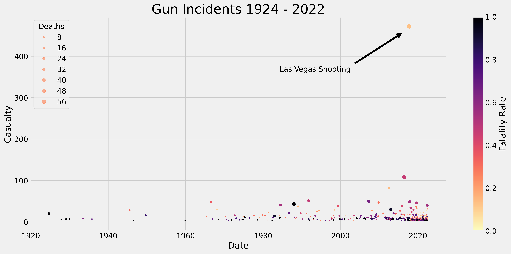
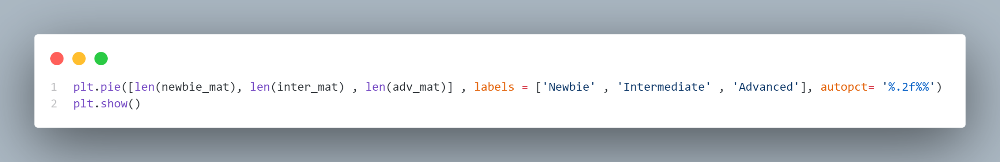
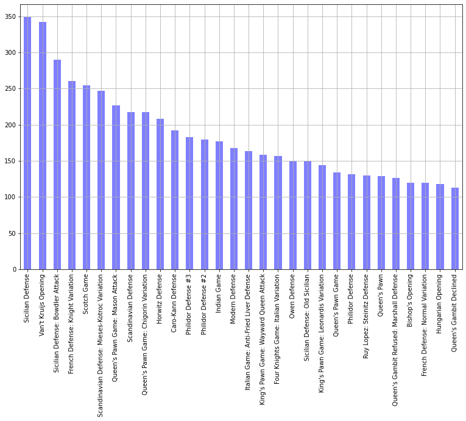

# CS103: Programming for Data Science
 Data visualization and analysis projects for the class CS103: Programming for Data Science at Fulbright University Vietnam.
#### Project 1: Data Visualization
Brief Description:
<ul>
<li> Find an online <a href="https://www.kaggle.com/datasets/zusmani/us-mass-shootings-last-50-years" target="_blank">dataset</a>.
<li> Process and clean the dataset with Pandas.
<li> Visualize the dataset with Matplotlib.
<li> Describe and interpret the visualizations in a report.
</ul>
Some Illustration:

#### Progject 2: Data Analysis
Brief Description: Find, clean, visualize, and analyze an online <a href="https://www.kaggle.com/datasets/datasnaek/chess" target="_blank">dataset</a> with Pandas, numpy and Matplotlib.
Some Illustrations: 

#### Progject 3: Linear Regression
Bried Description: 
<ul>
<>

